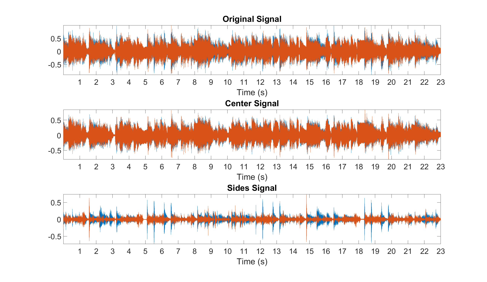
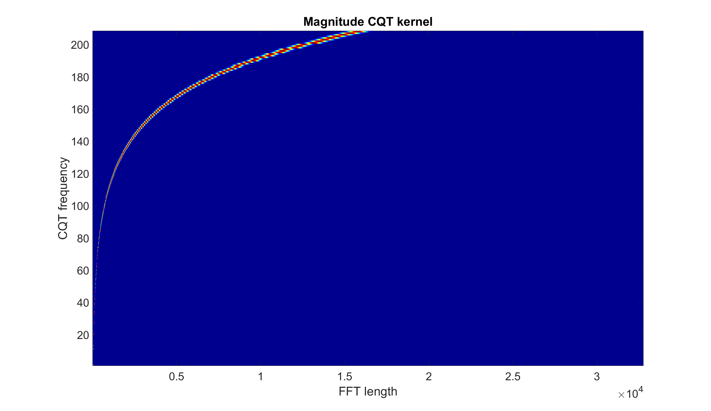
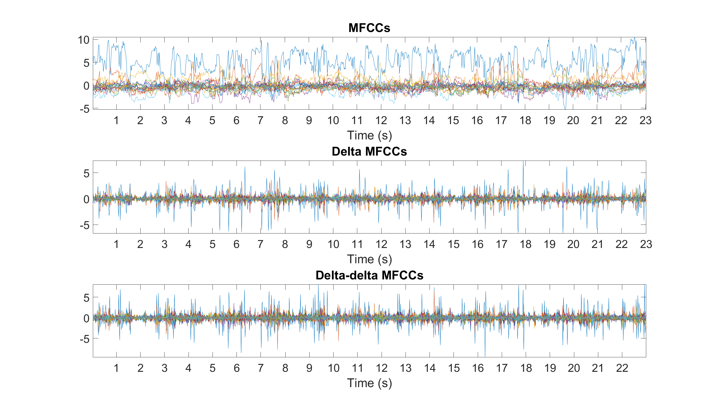
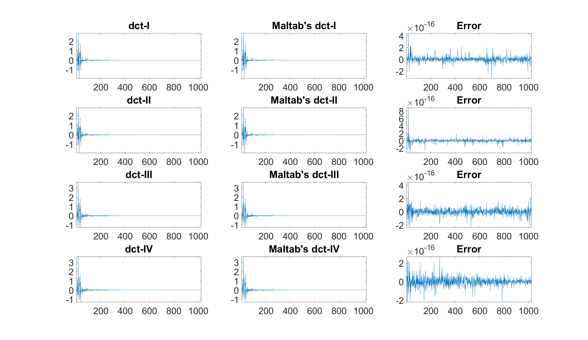
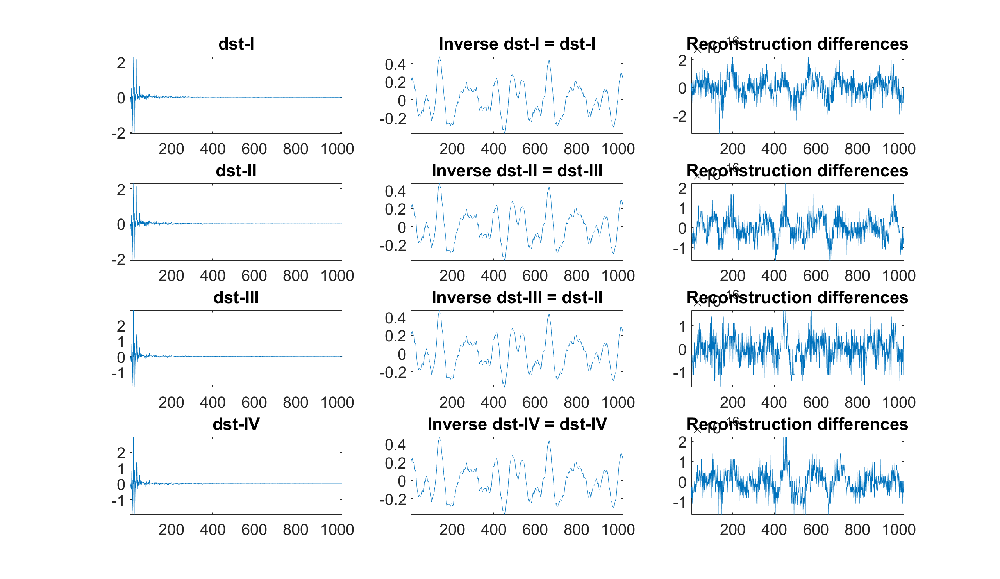
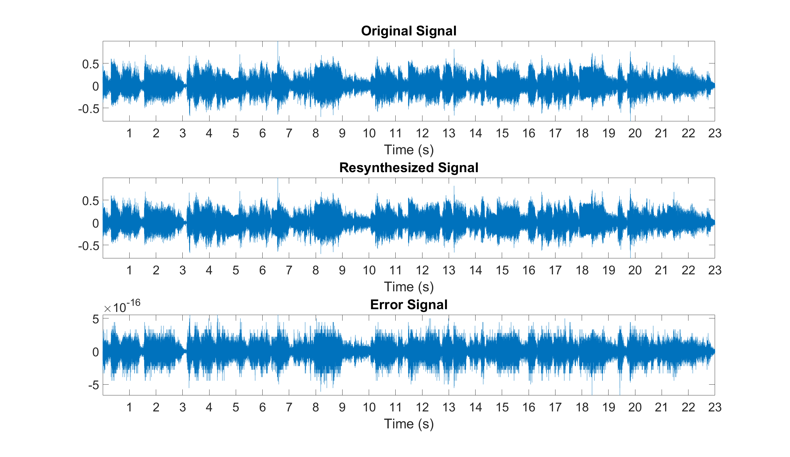

# Z

This repository includes a Matlab class and a Julia module which implement/illustrate several methods/functions for audio signal processing.

- For the updated Python module, see: https://github.com/zafarrafii/Zaf-Python
- For the updated Julia module, see: https://github.com/zafarrafii/Zaf-Julia

## z Matlab class

z This class implements several methods for audio signal processing.

z Methods:
- [stft - Short-time Fourier transform (STFT)](#stft-short-time-fourier-transform-stft)
- [istft - Inverse STFT](#istft-inverse-short-time-fourier-transform-stft)
- [cqtkernel - Constant-Q transform (CQT) kernel](#cqtkernel-constant-q-transform-cqt-kernel)
- [cqtspectrogram - CQT spectrogram using a CQT kernel](#cqtspectrogram-constant-q-transform-cqt-spectrogram-using-a-cqt-kernel)
- [cqtchromagram - CQT chromagram using a CQT kernel](#cqtchromagram-constant-q-transform-cqt-chromagram-using-a-cqt-kernel)
- [mfcc - Mel frequency cepstrum coefficients (MFCCs)](#mfcc-mel-frequency-cepstrum-coefficients-mfccs)
- [dct - Discrete cosine transform (DCT) using the fast Fourier transform (FFT)](#dct-discrete-cosine-transform-dct-using-the-fast-fourier-transform-fft)
- [dst - Discrete sine transform (DST) using the FFT](#dst-discrete-sine-transform-dst-using-the-fast-fourier-transform-fft)
- [mdct - Modified discrete cosine transform (MDCT) using the DCT-IV](#mdct-modified-discrete-cosine-transform-mdct-using-the-dct-iv)
- [imdct - Inverse MDCT using the DCT-IV](#imdct-inverse-modified-discrete-cosine-transform-mdct-using-the-dct-iv)

### stft Short-time Fourier transform (STFT)

`audio_stft = z.stft(audio_signal,window_function,step_length);`
    
Arguments:
```
audio_signal: audio signal [number_samples,1]
window_function: window function [window_length,1]
step_length: step length in samples
audio_stft: audio stft [window_length,number_frames]
```

Example: Compute and display the spectrogram of an audio file
```
% Audio signal averaged over its channels and sample rate in Hz
[audio_signal,sample_rate] = audioread('audio_file.wav');
audio_signal = mean(audio_signal,2);

% Window duration in seconds (audio is stationary around 40 milliseconds)
window_duration = 0.04;

% Window length in samples (power of 2 for fast FFT and constant overlap-add (COLA))
window_length = 2^nextpow2(window_duration*sample_rate);

% Window function (periodic Hamming window for COLA)
window_function = hamming(window_length,'periodic');

% Step length in samples (half the window length for COLA)
step_length = window_length/2;

% Magnitude spectrogram (without the DC component and the mirrored frequencies)
audio_stft = z.stft(audio_signal,window_function,step_length);
audio_spectrogram = abs(audio_stft(2:window_length/2+1,:));

% Spectrogram displayed in dB, s, and kHz
figure
imagesc(db(audio_spectrogram))
axis xy
colormap(jet)
title('Spectrogram (dB)')
xticks(round((1:floor(length(audio_signal)/sample_rate))*sample_rate/step_length))
xticklabels(1:floor(length(audio_signal)/sample_rate))
xlabel('Time (s)')
yticks(round((1e3:1e3:sample_rate/2)/sample_rate*window_length))
yticklabels(1:sample_rate/2*1e-3)
ylabel('Frequency (kHz)')
set(gca,'FontSize',30)
```


### istft Inverse short-time Fourier transform (STFT)

`audio_signal = z.istft(audio_stft,window_function,step_length);`

Arguments:
```
audio_stft: audio STFT [window_length,number_frames]
window_function: window function [window_length,1]
step_length: step length in samples
audio_signal: audio signal [number_samples,1]
```

Example: Estimate the center and sides signals of a stereo audio file
```
% Stereo signal and sample rate in Hz
[audio_signal,sample_rate] = audioread('audio_file.wav');

% Parameters for the STFT
window_duration = 0.04;
window_length = 2^nextpow2(window_duration*sample_rate);
window_function = hamming(window_length,'periodic');
step_length = window_length/2;

% STFT of the left and right channels
audio_stft1 = z.stft(audio_signal(:,1),window_function,step_length);
audio_stft2 = z.stft(audio_signal(:,2),window_function,step_length);

% Magnitude spectrogram (with DC component) of the left and right channels
audio_spectrogram1 = abs(audio_stft1(1:window_length/2+1,:));
audio_spectrogram2 = abs(audio_stft2(1:window_length/2+1,:));

% Time-frequency mask of the left and right channels of the center signal
center_mask1 = min(audio_spectrogram1,audio_spectrogram2)./audio_spectrogram1;
center_mask2 = min(audio_spectrogram1,audio_spectrogram2)./audio_spectrogram2;

% STFT of the left and right channels of the center signal (with extension to mirrored frequencies)
center_stft1 = [center_mask1;center_mask1(window_length/2:-1:2,:)].*audio_stft1;
center_stft2 = [center_mask2;center_mask2(window_length/2:-1:2,:)].*audio_stft2;

% Synthesized signals of the left and right channels of the center signal
center_signal1 = z.istft(center_stft1,window_function,step_length);
center_signal2 = z.istft(center_stft2,window_function,step_length);

% Finalized stereo center and sides signals
center_signal = [center_signal1,center_signal2];
center_signal = center_signal(1:length(audio_signal),:);
sides_signal = audio_signal-center_signal;

% Synthesized center and side signals
audiowrite('center_signal.wav',center_signal,sample_rate);
audiowrite('sides_signal.wav',sides_signal,sample_rate);

% Original, center, and sides signals displayed in s
figure
subplot(3,1,1), plot(audio_signal), axis tight, title('Original Signal')
xticks(sample_rate:sample_rate:length(audio_signal))
xticklabels(1:floor(length(audio_signal)/sample_rate))
xlabel('Time (s)'), set(gca,'FontSize',30)
subplot(3,1,2), plot(center_signal), axis tight, title('Center Signal')
xticks(sample_rate:sample_rate:length(audio_signal))
xticklabels(1:floor(length(audio_signal)/sample_rate))
xlabel('Time (s)'), set(gca,'FontSize',30)
subplot(3,1,3), plot(sides_signal), axis tight, title('Sides Signal')
xticks(sample_rate:sample_rate:length(audio_signal))
xticklabels(1:floor(length(audio_signal)/sample_rate))
xlabel('Time (s)'), set(gca,'FontSize',30)
```



### cqtkernel Constant-Q transform (CQT) kernel

`cqt_kernel = z.cqtkernel(sample_rate,frequency_resolution,minimum_frequency,maximum_frequency);`

Arguments:
```
sample_rate: sample rate in Hz
frequency_resolution: frequency resolution in number of frequency channels per semitone
minimum_frequency: minimum frequency in Hz
maximum_frequency: maximum frequency in Hz
cqt_kernel: CQT kernel [number_frequencies,fft_length]
```

Example: Compute and display the CQT kernel
```
% CQT kernel parameters
sample_rate = 44100;
frequency_resolution = 2;
minimum_frequency = 55;
maximum_frequency = sample_rate/2;

% CQT kernel
cqt_kernel = z.cqtkernel(sample_rate,frequency_resolution,minimum_frequency,maximum_frequency);

% Magnitude CQT kernel displayed
figure
imagesc(abs(cqt_kernel))
axis xy
colormap(jet)
title('Magnitude CQT kernel')
xlabel('FFT length')
ylabel('CQT frequency')
set(gca,'FontSize',30)
```



### cqtspectrogram Constant-Q transform (CQT) spectrogram using a CQT kernel

`audio_spectrogram = z.cqtspectrogram(audio_signal,sample_rate,time_resolution,cqt_kernel);`

Arguments:
```
audio_signal: audio signal [number_samples,1]
sample_rate: sample rate in Hz
time_resolution: time resolution in number of time frames per second
cqt_kernel: CQT kernel [number_frequencies,fft_length]
audio_spectrogram: audio spectrogram in magnitude [number_frequencies,number_times]
```
Example: Compute and display the CQT spectrogram
```
% Audio file averaged over the channels and sample rate in Hz
[audio_signal,sample_rate] = audioread('audio_file.wav');
audio_signal = mean(audio_signal,2);

% CQT kernel
frequency_resolution = 2;
minimum_frequency = 55;
maximum_frequency = 3520;
cqt_kernel = z.cqtkernel(sample_rate,frequency_resolution,minimum_frequency,maximum_frequency);

% CQT spectrogram
time_resolution = 25;
audio_spectrogram = z.cqtspectrogram(audio_signal,sample_rate,time_resolution,cqt_kernel);

% CQT spectrogram displayed in dB, s, and semitones
figure
imagesc(db(audio_spectrogram))
axis xy
colormap(jet)
title('CQT spectrogram (dB)')
xticks(round((1:floor(length(audio_signal)/sample_rate))*time_resolution))
xticklabels(1:floor(length(audio_signal)/sample_rate))
xlabel('Time (s)')
yticks(1:12*frequency_resolution:6*12*frequency_resolution)
yticklabels({'A1 (55 Hz)','A2 (110 Hz)','A3 (220 Hz)','A4 (440 Hz)','A5 (880 Hz)','A6 (1760 Hz)'})
ylabel('Frequency (semitones)')
set(gca,'FontSize',30)
```


### cqtchromagram Constant-Q transform (CQT) chromagram using a CQT kernel

`audio_chromagram = z.cqtchromagram(audio_signal,sample_rate,time_resolution,frequency_resolution,cqt_kernel);`

Arguments:
```
audio_signal: audio signal [number_samples,1]
sample_rate: sample rate in Hz
time_resolution: time resolution in number of time frames per second
frequency_resolution: frequency resolution in number of frequency channels per semitones
cqt_kernel: CQT kernel [number_frequencies,fft_length]
audio_chromagram: audio chromagram [number_chromas,number_times]
```

Example: Compute and display the CQT chromagram
```
% Audio file averaged over the channels and sample rate in Hz
[audio_signal,sample_rate] = audioread('audio_file.wav');
audio_signal = mean(audio_signal,2);

% CQT kernel
frequency_resolution = 2;
minimum_frequency = 55;
maximum_frequency = 3520;
cqt_kernel = z.cqtkernel(sample_rate,frequency_resolution,minimum_frequency,maximum_frequency);

% CQT chromagram
time_resolution = 25;
audio_chromagram = z.cqtchromagram(audio_signal,sample_rate,time_resolution,frequency_resolution,cqt_kernel);

% CQT chromagram displayed in dB, s, and chromas
figure
imagesc(db(audio_chromagram))
axis xy
colormap(jet)
title('CQT chromagram (dB)')
xticks(round((1:floor(length(audio_signal)/sample_rate))*time_resolution))
xticklabels(1:floor(length(audio_signal)/sample_rate))
xlabel('Time (s)')
yticks(1:frequency_resolution:12*frequency_resolution)
yticklabels({'A','A#','B','C','C#','D','D#','E','F','F#','G','G#'})
ylabel('Chroma')
set(gca,'FontSize',30)
```


### mfcc Mel frequency cepstrum coefficients (MFCCs)

`audio_mfcc = z.mfcc(audio_signal,sample_rate,number_filters,number_coefficients);`

Arguments:
```
audio_signal: audio signal [number_samples,1]
sample_rate: sample rate in Hz
number_filters: number of filters
number_coefficients: number of coefficients (without the 0th coefficient)
audio_mfcc: audio MFCCs [number_times,number_coefficients]
```

Example: Compute and display the MFCCs, delta MFCCs, and delta-detla MFCCs
```
% Audio signal averaged over its channels and sample rate in Hz
[audio_signal,sample_rate] = audioread('audio_file.wav');
audio_signal = mean(audio_signal,2);

% MFCCs for a given number of filters and coefficients
number_filters = 40;
number_coefficients = 20;
audio_mfcc = z.mfcc(audio_signal,sample_rate,number_filters,number_coefficients);

% Delta and delta-delta MFCCs
audio_deltamfcc = diff(audio_mfcc,1,2);
audio_deltadeltamfcc = diff(audio_deltamfcc,1,2);

% MFCCs, delta MFCCs, and delta-delta MFCCs displayed in s
step_length = (2^nextpow2(0.04*sample_rate))/2;
figure
subplot(3,1,1), plot(audio_mfcc'), axis tight, title('MFCCs')
xticks(round((1:floor(length(audio_signal)/sample_rate))*sample_rate/step_length))
xticklabels(1:floor(length(audio_signal)/sample_rate))
xlabel('Time (s)'), set(gca,'FontSize',30)
subplot(3,1,2), plot(audio_deltamfcc'), axis tight, title('Delta MFCCs')
xticks(round((1:floor(length(audio_signal)/sample_rate))*sample_rate/step_length))
xticklabels(1:floor(length(audio_signal)/sample_rate))
xlabel('Time (s)'), set(gca,'FontSize',30)
subplot(3,1,3), plot(audio_deltadeltamfcc'), axis tight, title('Delta-delta MFCCs')
xticks(round((1:floor(length(audio_signal)/sample_rate))*sample_rate/step_length))
xticklabels(1:floor(length(audio_signal)/sample_rate))
xlabel('Time (s)'), set(gca,'FontSize',30)
```



### dct Discrete cosine transform (DCT) using the fast Fourier transform (FFT)

`audio_dct = z.dct(audio_signal,dct_type);`

Arguments:
```
audio_signal: audio signal [number_samples,number_frames]
dct_type: dct type (1, 2, 3, or 4)
audio_dct: audio DCT [number_frequencies,number_frames]
```

Example: Compute the 4 different DCTs and compare them to Matlab's DCTs
```
% Audio signal averaged over its channels and sample rate in Hz
[audio_signal,sample_rate] = audioread('audio_file.wav');
audio_signal = mean(audio_signal,2);

% Audio signal for a given window length, and one frame
window_length = 1024;
audio_signal = audio_signal(1:window_length);

% DCT-I, II, III, and IV
audio_dct1 = z.dct(audio_signal,1);
audio_dct2 = z.dct(audio_signal,2);
audio_dct3 = z.dct(audio_signal,3);
audio_dct4 = z.dct(audio_signal,4);

% Matlab's DCT-I, II, III, and IV
matlab_dct1 = dct(audio_signal,'Type',1);
matlab_dct2 = dct(audio_signal,'Type',2);
matlab_dct3 = dct(audio_signal,'Type',3);
matlab_dct4 = dct(audio_signal,'Type',4);

% DCT-I, II, III, and IV, Matlab's versions, and errors displayed
figure
subplot(4,3,1), plot(audio_dct1), axis tight, title('DCT-I'), set(gca,'FontSize',30)
subplot(4,3,2), plot(matlab_dct1), axis tight, title('Maltab''s DCT-I'), set(gca,'FontSize',30)
subplot(4,3,3), plot(audio_dct1-matlab_dct1), axis tight, title('Error'), set(gca,'FontSize',30)
subplot(4,3,4), plot(audio_dct2), axis tight, title('DCT-II'), set(gca,'FontSize',30)
subplot(4,3,5), plot(matlab_dct2),axis tight, title('Maltab''s DCT-II'), set(gca,'FontSize',30)
subplot(4,3,6), plot(audio_dct2-matlab_dct2), axis tight, title('Error'), set(gca,'FontSize',30)
subplot(4,3,7), plot(audio_dct3), axis tight, title('DCT-III'), set(gca,'FontSize',30)
subplot(4,3,8), plot(matlab_dct3), axis tight, title('Maltab''s DCT-III'), set(gca,'FontSize',30)
subplot(4,3,9), plot(audio_dct3-matlab_dct3), axis tight, title('Error'), set(gca,'FontSize',30)
subplot(4,3,10), plot(audio_dct4), axis tight, title('DCT-IV'), set(gca,'FontSize',30)
subplot(4,3,11), plot(matlab_dct4), axis tight, title('Maltab''s DCT-IV'), set(gca,'FontSize',30)
subplot(4,3,12), plot(audio_dct4-matlab_dct4), axis tight, title('Error'), set(gca,'FontSize',30)
```



### dst Discrete sine transform (DST) using the fast Fourier transform (FFT)

`audio_dst = z.dst(audio_signal,dst_type);`

Arguments:
```
audio_signal: audio signal [number_samples,number_frames]
dst_type: DST type (1, 2, 3, or 4)
audio_dst: audio DST [number_frequencies,number_frames]
```

Example: Compute the 4 different DSTs and compare them to their respective inverses
```
% Audio signal averaged over its channels and sample rate in Hz
[audio_signal,sample_rate] = audioread('audio_file.wav');
audio_signal = mean(audio_signal,2);

% Audio signal for a given window length, and one frame
window_length = 1024;
audio_signal = audio_signal(1:window_length);

% DST-I, II, III, and IV
audio_dst1 = z.dst(audio_signal,1);
audio_dst2 = z.dst(audio_signal,2);
audio_dst3 = z.dst(audio_signal,3);
audio_dst4 = z.dst(audio_signal,4);

% Respective inverses, i.e., DST-I, III, II, and IV
audio_idst1 = z.dst(audio_dst1,1);
audio_idst2 = z.dst(audio_dst2,3);
audio_idst3 = z.dst(audio_dst3,2);
audio_idst4 = z.dst(audio_dst4,4);

% DST-I, II, III, and IV, respective inverses, and errors displayed
figure
subplot(4,3,1), plot(audio_dst1), axis tight, title('DST-I'), set(gca,'FontSize',30)
subplot(4,3,2), plot(audio_idst1), axis tight, title('Inverse DST-I = DST-I'), set(gca,'FontSize',30)
subplot(4,3,3), plot(audio_signal-audio_idst1), axis tight, title('Error'), set(gca,'FontSize',30)
subplot(4,3,4), plot(audio_dst2), axis tight, title('DST-II'), set(gca,'FontSize',30)
subplot(4,3,5), plot(audio_idst2), axis tight, title('Inverse DST-II = DST-III'), set(gca,'FontSize',30)
subplot(4,3,6), plot(audio_signal-audio_idst2), axis tight, title('Error'), set(gca,'FontSize',30)
subplot(4,3,7), plot(audio_dst3), axis tight, title('DST-III'), set(gca,'FontSize',30)
subplot(4,3,8), plot(audio_idst3), axis tight, title('Inverse DST-III = DST-II'), set(gca,'FontSize',30)
subplot(4,3,9), plot(audio_signal-audio_idst3), axis tight, title('Error'), set(gca,'FontSize',30)
subplot(4,3,10), plot(audio_dst4), axis tight, title('DST-IV'), set(gca,'FontSize',30)
subplot(4,3,11), plot(audio_idst4), axis tight, title('Inverse DST-IV = DST-IV'), set(gca,'FontSize',30)
subplot(4,3,12), plot(audio_signal-audio_idst4, axis tight, title('Error'), set(gca,'FontSize',30)
```



### mdct Modified discrete cosine transform (MDCT) using the DCT-IV

`audio_mdct = z.mdct(audio_signal,window_function);`

Arguments:
```
audio_signal: audio signal [number_samples,1]
window_function: window function [window_length,1]
audio_mdct: audio MDCT [number_frequencies,number_times]
```

Example: Compute and display the MDCT as used in the AC-3 audio coding format
```
% Audio file averaged over the channels and sample rate in Hz
[audio_signal,sample_rate] = audioread('audio_file.wav');
audio_signal = mean(audio_signal,2);

% Kaiser-Bessel-derived (KBD) window as used in the AC-3 audio coding format
window_length = 2048;
alpha_value = 5;
window_function = kaiser(window_length/2+1,alpha_value*pi);
window_function2 = cumsum(window_function(1:window_length/2));
window_function = sqrt([window_function2;window_function2(window_length/2:-1:1)]./sum(window_function));

% MDCT
audio_mdct = z.mdct(audio_signal,window_function);

% MDCT displayed in dB, s, and kHz
figure
imagesc(db(audio_mdct))
axis xy
colormap(jet)
title('mdct (dB)')
xticks(round((1:floor(length(audio_signal)/sample_rate))*sample_rate/(window_length/2)))
xticklabels(1:floor(length(audio_signal)/sample_rate))
xlabel('Time (s)')
yticks(round((1e3:1e3:sample_rate/2)/sample_rate*window_length))
yticklabels(1:sample_rate/2*1e-3)
ylabel('Frequency (kHz)')
set(gca,'FontSize',30)
```


### imdct Inverse modified discrete cosine transform (MDCT) using the DCT-IV

`audio_signal = z.imdct(audio_mdct,window_function);`

Arguments:
```
window_function: window function [window_length,1]
audio_mdct: audio MDCT [number_frequencies,number_times]
audio_signal: audio signal [number_samples,1]
```

Example: Verify that the MDCT is perfectly invertible
```
% Audio file averaged over the channels and sample rate in Hz
[audio_signal,sample_rate] = audioread('audio_file.wav');
audio_signal = mean(audio_signal,2);

% MDCT with a slope function as used in the Vorbis audio coding format
window_length = 2048;
window_function = sin((pi/2)*sin((pi/window_length)*(1/2:(window_length-1/2))).^2)';
audio_mdct = z.mdct(audio_signal,window_function);

% Inverse MDCT and error signal
audio_signal2 = z.imdct(audio_mdct,window_function);
audio_signal2 = audio_signal2(1:length(audio_signal));
error_signal = audio_signal-audio_signal2;

% Original, resynthesized, and error signals displayed in
figure
subplot(3,1,1), plot(audio_signal), axis tight, title('Original Signal')
xticks(sample_rate:sample_rate:length(audio_signal))
xticklabels(1:floor(length(audio_signal)/sample_rate))
xlabel('Time (s)'), set(gca,'FontSize',30)
subplot(3,1,2), plot(audio_signal2), axis tight, title('Resynthesized Signal')
xticks(sample_rate:sample_rate:length(audio_signal))
xticklabels(1:floor(length(audio_signal)/sample_rate))
xlabel('Time (s)'), set(gca,'FontSize',30)
subplot(3,1,3), plot(error_signal), axis tight, title('Error Signal')
xticks(sample_rate:sample_rate:length(audio_signal))
xticklabels(1:floor(length(audio_signal)/sample_rate))
xlabel('Time (s)'), set(gca,'FontSize',30)
```




## Author

- Zafar Rafii
- zafarrafii@gmail.com
- [Website](http://zafarrafii.com/)
- [CV](http://zafarrafii.com/Zafar%20Rafii%20-%20C.V..pdf)
- [Google Scholar](https://scholar.google.com/citations?user=8wbS2EsAAAAJ&hl=en)
- [LinkedIn](https://www.linkedin.com/in/zafarrafii/)
