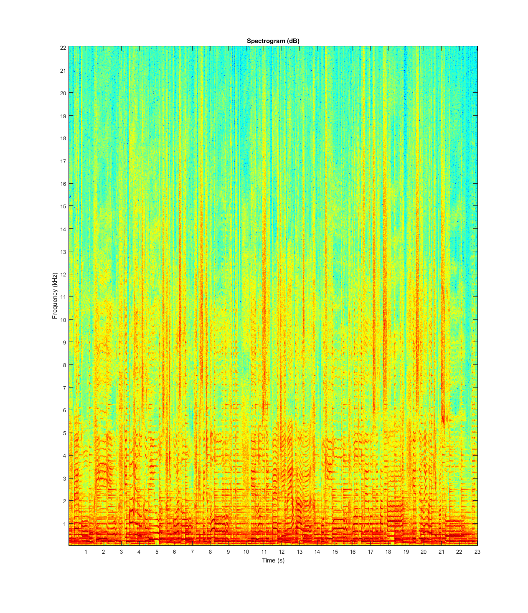
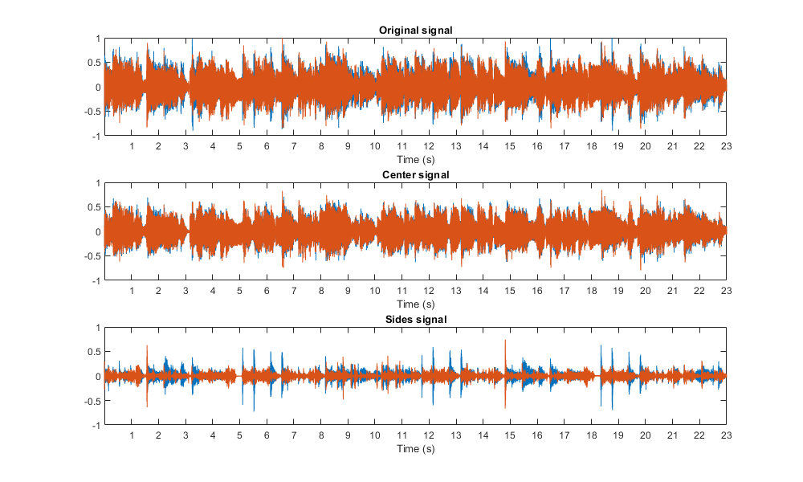
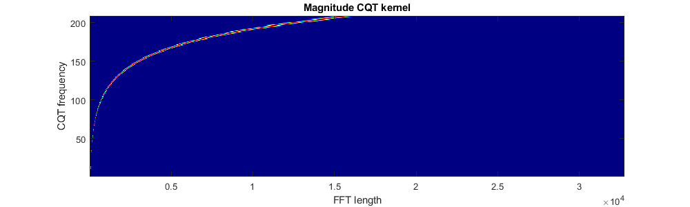
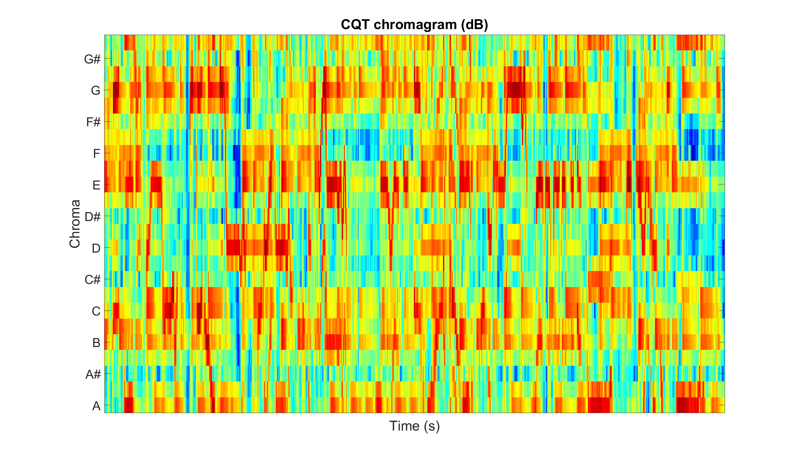
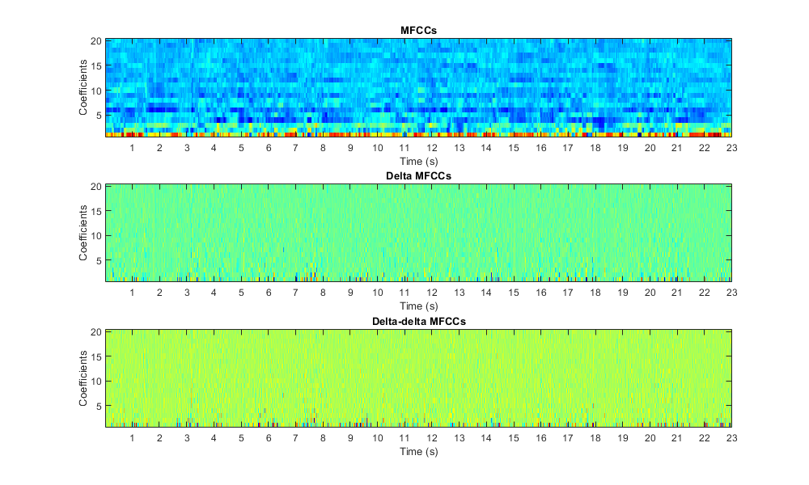
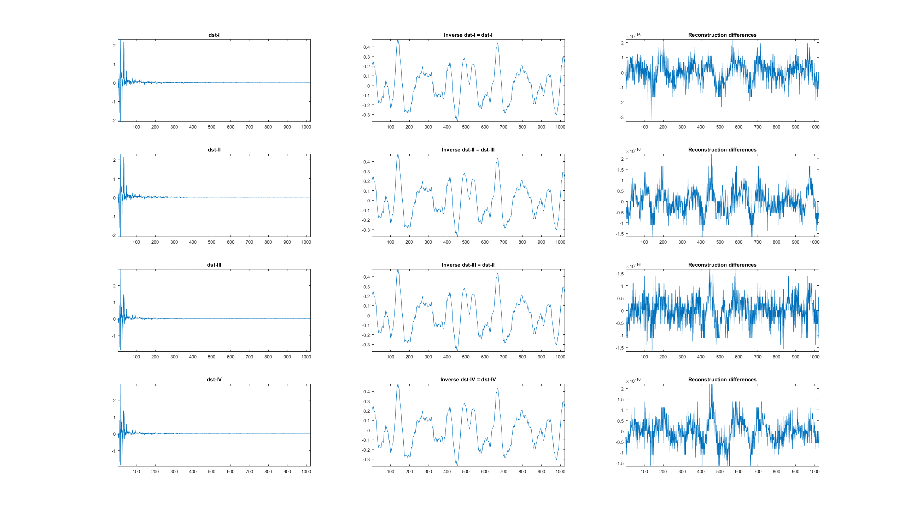
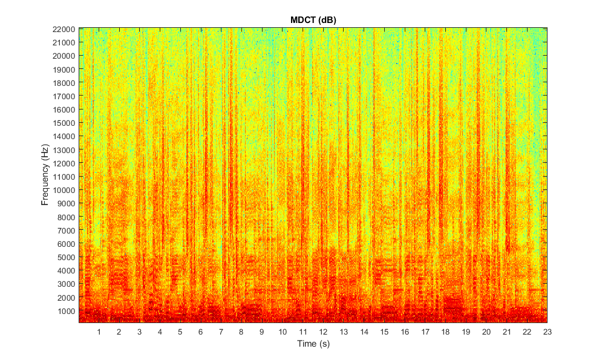
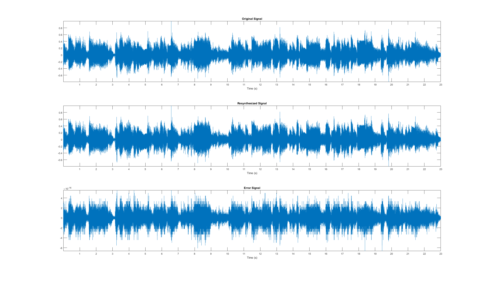

# Zaf-Matlab

Zafar's Audio Functions in **Matlab** for audio signal analysis.

- [`zaf.m`](#zafm): Matlab class with the audio functions.
- [`examples.ipynb`](#examplesipynb): Jupyter notebook with some examples.
- [`audio_file.wav`](#audio_filewav): audio file used for the examples.

See also:
- [Zaf-Julia](https://github.com/zafarrafii/Zaf-Julia): Zafar's Audio Functions in **Julia** for audio signal analysis.
- [Zaf-Python](https://github.com/zafarrafii/Zaf-Python): Zafar's Audio Functions in **Python** for audio signal analysis.

## zaf.m

This Matlab class implements a number of functions for audio signal analysis.

Simply copy the file `zaf.m` in your working directory and you are good to go.

Functions:
- [`stft`](#stft) - Compute the short-time Fourier transform (STFT).
- [`istft`](#istft) - Compute the inverse STFT.
- [`cqtkernel`](#cqtkernel) - Compute the constant-Q transform (CQT) kernel.
- [`cqtspectrogram`](#cqtspectrogram) - Compute the CQT spectrogram using a CQT kernel.
- [`cqtchromagram`](#cqtchromagram) - Compute the CQT chromagram using a CQT kernel.
- [`mfcc`](#mfcc) - Compute the mel frequency cepstrum coefficients (MFCCs).
- [`dct`](#dct) - Compute the discrete cosine transform (DCT) using the fast Fourier transform (FFT).
- [`dst`](#dst) - Compute the discrete sine transform (DST) using the FFT.
- [`mdct`](#mdct) - Compute the modified discrete cosine transform (MDCT) using the FFT.
- [`imdct`](#imdct) - Compute the inverse MDCT using the FFT.

Other:
- `sigplot` - Plot a signal in seconds.
- `specshow` - Display a spectrogram in dB, seconds, and Hz..
- `cqtspecshow` - Display a CQT spectrogram in dB, seconds, and Hz.
- `cqtchromshow` - Display a CQT chromagram in seconds.

### stft

Compute the short-time Fourier transform (STFT).

```
audio_stft = zaf.stft(audio_signal, window_function, step_length)
    
Inputs:
    audio_signal: audio signal (number_samples,)
    window_function: window function (window_length,)
    step_length: step length in samples
Output:
    audio_stft: audio STFT (window_length, number_frames)
```

#### Example: Compute and display the spectrogram from an audio file.

```
% Read the audio signal with its sampling frequency in Hz, and average it over its channels
[audio_signal,sampling_frequency] = audioread('audio_file.wav');
audio_signal = mean(audio_signal,2);

% Set the window duration in seconds (audio is stationary around 40 milliseconds)
window_duration = 0.04;

% Derive the window length in samples (use powers of 2 for faster FFT and constant overlap-add (COLA))
window_length = 2^nextpow2(window_duration*sampling_frequency);

% Compute the window function (periodic Hamming window for COLA)
window_function = hamming(window_length,'periodic');

% Set the step length in samples (half of the window length for COLA)
step_length = window_length/2;

% Compute the STFT
audio_stft = zaf.stft(audio_signal,window_function,step_length);

% Derive the magnitude spectrogram (without the DC component and the mirrored frequencies)
audio_spectrogram = abs(audio_stft(2:window_length/2+1,:));

% Display the spectrogram in dB, seconds, and Hz
xtick_step = 1;
ytick_step = 1000;
figure
zaf.specshow(audio_spectrogram, length(audio_signal), sampling_frequency, xtick_step, ytick_step);
title('Spectrogram (dB)')
```




### istft

Compute the inverse short-time Fourier transform (STFT).

```
audio_signal = zaf.istft(audio_stft, window_function, step_length)

Inputs:
    audio_stft: audio STFT (window_length, number_frames)
    window_function: window function (window_length,)
    step_length: step length in samples
Output:
    audio_signal: audio signal (number_samples,)
```

#### Example: Estimate the center and the sides from a stereo audio file.

```
% Read the (stereo) audio signal with its sampling frequency in Hz
[audio_signal,sample_rate] = audioread('audio_file.wav');

% Set the parameters for the STFT
window_duration = 0.04;
window_length = 2^nextpow2(window_duration*sample_rate);
window_function = hamming(window_length,'periodic');
step_length = window_length/2;

% Compute the STFTs for the left and right channels
audio_stft1 = zaf.stft(audio_signal(:,1),window_function,step_length);
audio_stft2 = zaf.stft(audio_signal(:,2),window_function,step_length);

% Derive the magnitude spectrograms (with DC component) for the left and right channels
audio_spectrogram1 = abs(audio_stft1(1:window_length/2+1,:));
audio_spectrogram2 = abs(audio_stft2(1:window_length/2+1,:));

% Estimate the time-frequency masks for the left and right channels for the center
center_mask1 = min(audio_spectrogram1,audio_spectrogram2)./audio_spectrogram1;
center_mask2 = min(audio_spectrogram1,audio_spectrogram2)./audio_spectrogram2;

% Derive the STFTs for the left and right channels for the center (with mirrored frequencies)
center_stft1 = [center_mask1;center_mask1(window_length/2:-1:2,:)].*audio_stft1;
center_stft2 = [center_mask2;center_mask2(window_length/2:-1:2,:)].*audio_stft2;

% Synthesize the signals for the left and right channels for the center
center_signal1 = zaf.istft(center_stft1,window_function,step_length);
center_signal2 = zaf.istft(center_stft2,window_function,step_length);

% Derive the final stereo center and sides signals
center_signal = [center_signal1,center_signal2];
center_signal = center_signal(1:length(audio_signal),:);
sides_signal = audio_signal-center_signal;

% Write the center and sides signals
audiowrite('center_signal.wav',center_signal,sample_rate);
audiowrite('sides_signal.wav',sides_signal,sample_rate);

% Display the original, center, and sides signals in seconds
xtick_step = 1;
figure
subplot(3,1,1)
zaf.sigplot(audio_signal, sampling_frequency, xtick_step)
ylim([-1,1]), title("Original signal")
subplot(3,1,2)
zaf.sigplot(center_signal, sampling_frequency, xtick_step)
ylim([-1,1]), title("Center signal")
subplot(3,1,3)
zaf.sigplot(sides_signal, sampling_frequency, xtick_step)
ylim([-1,1]), title("Sides signal")
```




### cqtkernel

Compute the constant-Q transform (CQT) kernel.

```
cqt_kernel = zaf.cqtkernel(sampling_frequency, frequency_resolution, minimum_frequency, maximum_frequency)

Inputs:
    sampling_frequency: sampling frequency in Hz
    frequency_resolution: frequency resolution in number of frequency channels per semitone
    minimum_frequency: minimum frequency in Hz
    maximum_frequency: maximum frequency in Hz
Output:
    cqt_kernel: CQT kernel (number_frequencies, fft_length)
```

#### Example: Compute and display the CQT kernel.

```
% Set the parameters for the CQT kernel
sampling_frequency = 44100;
frequency_resolution = 2;
minimum_frequency = 55;
maximum_frequency = sampling_frequency/2;

% Compute the CQT kernel
cqt_kernel = zaf.cqtkernel(sampling_frequency,frequency_resolution,minimum_frequency,maximum_frequency);

% Display the magnitude CQT kernel
figure
imagesc(abs(cqt_kernel))
axis xy
colormap(jet)
title('Magnitude CQT kernel')
xlabel('FFT length')
ylabel('CQT frequency')
```




### cqtspectrogram

Compute the constant-Q transform (CQT) kernel.

```
audio_spectrogram = zaf.cqtspectrogram(audio_signal, sample_rate, time_resolution, cqt_kernel)

Inputs:
    audio_signal: audio signal (number_samples,)
    sampling_frequency: sampling frequency in Hz
    time_resolution: time resolution in number of time frames per second
    cqt_kernel: CQT kernel (number_frequencies, fft_length)
Output:
    audio_spectrogram: audio spectrogram in magnitude (number_frequencies, number_times)
```

#### Example: Compute and display the CQT spectrogram.

```
% Read the audio signal with its sampling frequency in Hz, and average it over its channels
[audio_signal,sampling_frequency] = audioread('audio_file.wav');
audio_signal = mean(audio_signal,2);

% Compute the CQT kernel using some parameters
frequency_resolution = 2;
minimum_frequency = 55;
maximum_frequency = 3520;
cqt_kernel = zaf.cqtkernel(sampling_frequency,frequency_resolution,minimum_frequency,maximum_frequency);

% Compute the (magnitude) CQT spectrogram using the kernel
time_resolution = 25;
audio_spectrogram = zaf.cqtspectrogram(audio_signal,sampling_frequency,time_resolution,cqt_kernel);

% Display the CQT spectrogram in dB, seconds, and Hz
xtick_step = 1;
figure
zaf.cqtspecshow(audio_spectrogram,time_resolution,frequency_resolution,minimum_frequency,xtick_step);
title('CQT spectrogram (dB)')
```


### cqtchromagram

Compute the constant-Q transform (CQT) chromagram using a kernel.

```
audio_chromagram = zaf.cqtchromagram(audio_signal, sampling_frequency, time_resolution, frequency_resolution, cqt_kernel)

Inputs:
    audio_signal: audio signal (number_samples,)
    sampling_frequency: sampling frequency in Hz
    time_resolution: time resolution in number of time frames per second
    frequency_resolution: frequency resolution in number of frequency channels per semitones
    cqt_kernel: CQT kernel (number_frequencies, fft_length)
Output:
    audio_chromagram: audio chromagram (number_chromas, number_times)
```

#### Example: Compute and display the CQT chromagram.

```
% Read the audio signal with its sampling frequency in Hz, and average it over its channels
[audio_signal,sampling_frequency] = audioread('audio_file.wav');
audio_signal = mean(audio_signal,2);

% Compute the CQT kernel using some parameters
frequency_resolution = 2;
minimum_frequency = 55;
maximum_frequency = 3520;
cqt_kernel = zaf.cqtkernel(sampling_frequency,frequency_resolution,minimum_frequency,maximum_frequency);

% Compute the CQT chromagram
time_resolution = 25;
audio_chromagram = zaf.cqtchromagram(audio_signal,sampling_frequency,time_resolution,frequency_resolution,cqt_kernel);

% Display the CQT chromagram in seconds
xtick_step = 1;
figure
zaf.cqtchromshow(audio_chromagram,time_resolution,xtick_step)
title('CQT chromagram')
```




### mfcc

Compute the mel frequency cepstrum coefficients (MFFCs).

```
audio_mfcc = zaf.mfcc(audio_signal, sampling_frequency, number_filters, number_coefficients)

Inputs:
    audio_signal: audio signal (number_samples,)
    sampling_frequency: sampling frequency in Hz
    number_filters: number of filters
    number_coefficients: number of coefficients (without the 0th coefficient)
Output:
    audio_mfcc: audio MFCCs (number_times, number_coefficients)
```

#### Example: Compute and display the MFCCs, delta MFCCs, and delta-detla MFCCs.

```
% Read the audio signal with its sampling frequency in Hz, and average it over its channels
[audio_signal,sampling_frequency] = audioread('audio_file.wav')
audio_signal = mean(audio_signal,2);

% Compute the MFCCs with a given number of filters and coefficients
number_filters = 40;
number_coefficients = 20;
audio_mfcc = zaf.mfcc(audio_signal,sampling_frequency,number_filters,number_coefficients);

% Compute the delta and delta-delta MFCCs
audio_dmfcc = diff(audio_mfcc,1,2);
audio_ddmfcc = diff(audio_dmfcc,1,2);

% Compute the time resolution for the MFCCs in number of time frames per second (~ sampling frequency for the MFCCs)
time_resolution = sampling_frequency*size(audio_mfcc,2)/length(audio_signal);

% Display the MFCCs, delta MFCCs, and delta-delta MFCCs in seconds
xtick_step = 1;
figure
subplot(3,1,1)
zaf.sigplot(audio_mfcc',time_resolution,xtick_step), title('MFCCs')
subplot(3,1,2)
zaf.sigplot(audio_dmfcc',time_resolution,xtick_step), title('Delta MFCCs')
subplot(3,1,3)
zaf.sigplot(audio_ddmfcc',time_resolution,xtick_step), title('Delta MFCCs')
```




### dct

Compute the discrete cosine transform (DCT) using the fast Fourier transform (FFT).

```
audio_dct = zaf.dct(audio_signal, dct_type)

Inputs:
    audio_signal: audio signal (window_length,)
    dct_type: dct type (1, 2, 3, or 4)
Output:
    audio_dct: audio DCT (number_frequencies,)
```

#### Example: Compute the 4 different DCTs and compare them to MATLAB's DCTs.

```
% Read the audio signal with its sampling frequency in Hz, and average it over its channels
[audio_signal,sampling_frequency] = audioread('audio_file.wav');
audio_signal = mean(audio_signal,2);

% Get an audio segment for a given window length
window_length = 1024;
audio_segment = audio_signal(1:window_length);

% Compute the DCT-I, II, III, and IV
audio_dct1 = zaf.dct(audio_segment,1);
audio_dct2 = zaf.dct(audio_segment,2);
audio_dct3 = zaf.dct(audio_segment,3);
audio_dct4 = zaf.dct(audio_segment,4);

% Compute MATLAB's DCT-I, II, III, and IV
matlab_dct1 = dct(audio_segment,'Type',1);
matlab_dct2 = dct(audio_segment,'Type',2);
matlab_dct3 = dct(audio_segment,'Type',3);
matlab_dct4 = dct(audio_segment,'Type',4);

% Plot the DCT-I, II, III, and IV, MATLAB's versions, and their differences
figure
subplot(3,4,1), plot(audio_dct1), xlim([0,window_length]), title('DCT-I')
subplot(3,4,2), plot(audio_dct2), xlim([0,window_length]), title('DCT-II')
subplot(3,4,3), plot(audio_dct3), xlim([0,window_length]), title('DCT-III')
subplot(3,4,4), plot(audio_dct4), xlim([0,window_length]), title('DCT-IV')
subplot(3,4,5), plot(matlab_dct1), xlim([0,window_length]), title('MATLAB''s DCT-I')
subplot(3,4,6), plot(matlab_dct2), xlim([0,window_length]), title('MATLAB''s DCT-II')
subplot(3,4,7), plot(matlab_dct3), xlim([0,window_length]), title('MATLAB''s DCT-III')
subplot(3,4,8), plot(matlab_dct4), xlim([0,window_length]), title('MATLAB''s DCT-IV')
subplot(3,4,9), plot(audio_dct1-matlab_dct1), xlim([0,window_length]), title('DCT-I - MATLAB''s DCT-I')
subplot(3,4,10), plot(audio_dct2-matlab_dct2), xlim([0,window_length]), title('DCT-II - MATLAB''s DCT-II')
subplot(3,4,11), plot(audio_dct3-matlab_dct3), xlim([0,window_length]), title('DCT-III - MATLAB''s DCT-III')
subplot(3,4,12), plot(audio_dct4-matlab_dct4), xlim([0,window_length]), title('DCT-IV - MATLAB''s DCT-IV')
```


### dst

Compute the discrete sine transform (DST) using the fast Fourier transform (FFT).

```
audio_dst = zaf.dst(audio_signal, dst_type)

Inputs:
    audio_signal: audio signal (window_length,)
    dst_type: DST type (1, 2, 3, or 4)
Output:
    audio_dst: audio DST (number_frequencies,)
```

#### Example: Compute the 4 different DSTs and compare their respective inverses with the original audio.

```
% Read the audio signal with its sampling frequency in Hz, and average it over its channels
[audio_signal,sampling_frequency] = audioread('audio_file.wav');
audio_signal = mean(audio_signal,2);

% Get an audio segment for a given window length
window_length = 1024;
audio_segment = audio_signal(1:window_length);

% Compute the DST-I, II, III, and IV
audio_dst1 = zaf.dst(audio_segment,1);
audio_dst2 = zaf.dst(audio_segment,2);
audio_dst3 = zaf.dst(audio_segment,3);
audio_dst4 = zaf.dst(audio_segment,4);

% Compute their respective inverses, i.e., DST-I, II, III, and IV
audio_idst1 = zaf.dst(audio_dst1,1);
audio_idst2 = zaf.dst(audio_dst2,3);
audio_idst3 = zaf.dst(audio_dst3,2);
audio_idst4 = zaf.dst(audio_dst4,4);

% Plot the DST-I, II, III, and IV, their respective inverses, and their differences with the original audio segment
figure
subplot(3,4,1), plot(audio_dst1), xlim([0,window_length]), title('DST-I')
subplot(3,4,2), plot(audio_dst2), xlim([0,window_length]), title('DST-II')
subplot(3,4,3), plot(audio_dst3), xlim([0,window_length]), title('DST-III')
subplot(3,4,4), plot(audio_dst4), xlim([0,window_length]), title('DST-IV')
subplot(3,4,5), plot(audio_idst1), xlim([0,window_length]), title('Inverse DST-I (DST-I)')
subplot(3,4,6), plot(audio_idst2), xlim([0,window_length]), title('Inverse DST-II (DST-III)')
subplot(3,4,7), plot(audio_idst3), xlim([0,window_length]), title('Inverse DST-III (DST-II)')
subplot(3,4,8), plot(audio_idst4), xlim([0,window_length]), title('Inverse DST-IV (DST-IV)')
subplot(3,4,9), plot(audio_idst1-audio_segment), xlim([0,window_length]), title('Inverse DST-I - audio segment')
subplot(3,4,10), plot(audio_idst2-audio_segment), xlim([0,window_length]), title('Inverse DST-II - audio segment')
subplot(3,4,11), plot(audio_idst3-audio_segment), xlim([0,window_length]), title('Inverse DST-III - audio segment')
subplot(3,4,12), plot(audio_idst4-audio_segment), xlim([0,window_length]), title('Inverse DST-IV - audio segment')
```




### mdct

Compute the modified discrete cosine transform (MDCT) using the fast Fourier transform (FFT).

```
audio_mdct = zaf.mdct(audio_signal, window_function)

Inputs:
    audio_signal: audio signal (number_samples,)
    window_function: window function (window_length,)
Output:
    audio_mdct: audio MDCT (number_frequencies, number_times)
```

#### Example: Compute and display the MDCT as used in the AC-3 audio coding format.

```
% Read the audio signal with its sampling frequency in Hz, and average it over its channels
[audio_signal,sampling_frequency] = audioread('audio_file.wav');
audio_signal = mean(audio_signal,2);

% Compute the Kaiser-Bessel-derived (KBD) window as used in the AC-3 audio coding format
window_length = 512;
alpha_value = 5;
window_function = kaiser(window_length/2+1,alpha_value*pi);
window_function2 = cumsum(window_function(1:window_length/2));
window_function = sqrt([window_function2; window_function2(window_length/2:-1:1)]/sum(window_function));

% Compute the MDCT
audio_mdct = zaf.mdct(audio_signal,window_function);

% Display the MDCT in dB, seconds, and Hz
xtick_step = 1;
ytick_step = 1000;
figure
zaf.specshow(abs(audio_mdct),length(audio_signal),sampling_frequency,xtick_step,ytick_step)
title('MDCT (dB)')
```




### imdct

Compute the inverse modified discrete cosine transform (MDCT) using the fast Fourier transform (FFT).

```
audio_signal = zaf.imdct(audio_mdct, window_function)

Inputs:
    audio_mdct: audio MDCT (number_frequencies, number_times)
    window_function: window function (window_length,)
Output:
    audio_signal: audio signal (number_samples,)
```

#### Example: Verify that the MDCT is perfectly invertible.

```
% Audio file averaged over the channels and sample rate in Hz
[audio_signal,sample_rate] = audioread('audio_file.wav');
audio_signal = mean(audio_signal,2);

% MDCT with a slope function as used in the Vorbis audio coding format
window_length = 2048;
window_function = sin((pi/2)*sin((pi/window_length)*(1/2:(window_length-1/2))).^2)';
audio_mdct = z.mdct(audio_signal,window_function);

% Inverse MDCT and error signal
audio_signal2 = z.imdct(audio_mdct,window_function);
audio_signal2 = audio_signal2(1:length(audio_signal));
error_signal = audio_signal-audio_signal2;

% Original, resynthesized, and error signals displayed in
figure
subplot(3,1,1), plot(audio_signal), axis tight, title('Original Signal')
xticks(sample_rate:sample_rate:length(audio_signal))
xticklabels(1:floor(length(audio_signal)/sample_rate))
xlabel('Time (s)'), set(gca,'FontSize',30)
subplot(3,1,2), plot(audio_signal2), axis tight, title('Resynthesized Signal')
xticks(sample_rate:sample_rate:length(audio_signal))
xticklabels(1:floor(length(audio_signal)/sample_rate))
xlabel('Time (s)'), set(gca,'FontSize',30)
subplot(3,1,3), plot(error_signal), axis tight, title('Error Signal')
xticks(sample_rate:sample_rate:length(audio_signal))
xticklabels(1:floor(length(audio_signal)/sample_rate))
xlabel('Time (s)'), set(gca,'FontSize',30)
```




## examples.ipynb

This Jupyter notebook shows some examples for the different functions of the Matlab class `zaf`.

See [Jupyter notebook viewer](https://nbviewer.jupyter.org/github/zafarrafii/Zaf-Matlab/blob/master/examples.ipynb).


## audio_file.wav

23 second audio excerpt from the song *Que Pena Tanto Faz* performed by *Tamy*.


# Author

- Zafar Rafii
- zafarrafii@gmail.com
- http://zafarrafii.com/
- [CV](http://zafarrafii.com/Zafar%20Rafii%20-%20C.V..pdf)
- [GitHub](https://github.com/zafarrafii)
- [LinkedIn](https://www.linkedin.com/in/zafarrafii/)
- [Google Scholar](https://scholar.google.com/citations?user=8wbS2EsAAAAJ&hl=en)
